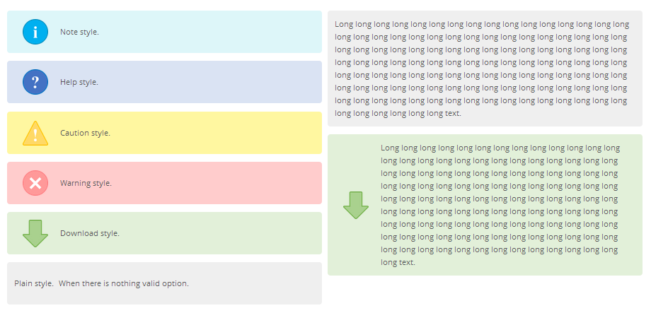

# Infobox_KARASPlugin

This is plugin for KARAS-php.
You can make infobox like following image.



## How to Use

```
[[infobox::
your text
]]
```

or

```
[[infobox::note::
your text
]]
```

There is some valid options, "note", "help", "caution", "warning", and "download".

## License

This plugin is licensed under BSD-style license (same as KARAS).
Please check this Sourcecode.
